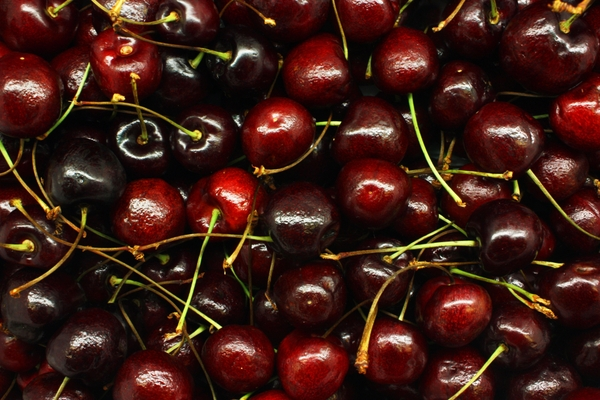
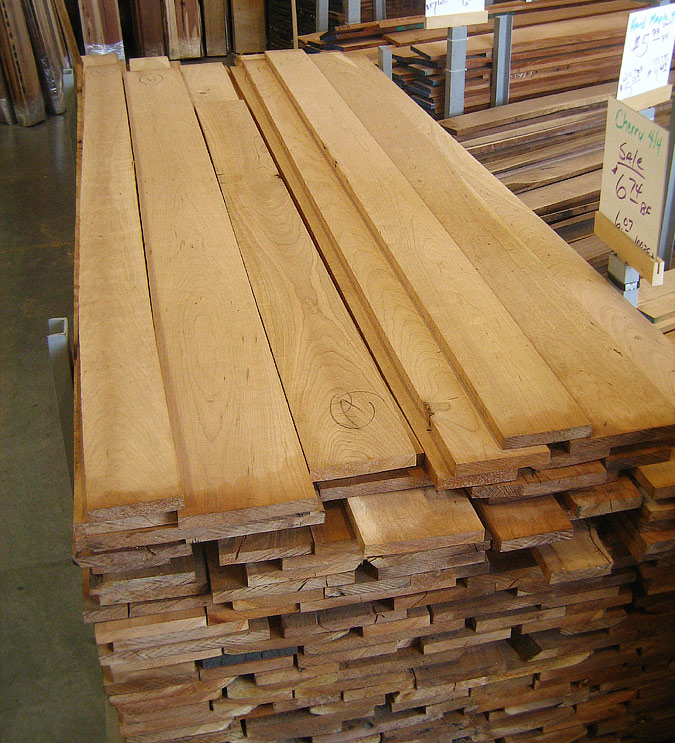

--- 
title       : Lumber 
subtitle    : How much can I get from this tree?
author      : codith
job         : Developing Data Products, Coursera Data Science Specialization
framework   : io2012        # {io2012, html5slides, shower, dzslides, ...}
highlighter : highlight.js  # {highlight.js, prettify, highlight}
hitheme     : tomorrow      # 
widgets     : [bootstrap, mathjax]   # {mathjax, quiz, bootstrap}
mode        : selfcontained # {standalone, draft}
knit        : slidify::knit2slides
--- 

## Use for flowers and fruit

Black cherry trees are best known for their prolific flowering and their fruit.

Cherry blossom festivals in Japan are known worldwide, and a similar festival 
takes place in Washington, DC, every spring.

--- 

## Use for lumber

Cherry wood is often used in high-end wood furniture because of its appearance
and stability.

Harvesting a cherry tree for wood prevents its use for aestetic or food 
purposes, as tables have not been observed to produce flowers or fruit.

---

## Harvesting for wood

Naturally, if we are to harvest cherry trees for wood, we would want to 
harvest the trees that will yield the most wood. A data set is built into R
that reports the lumber yield, height, and girth for 31 black cherry trees.

Unsuprisingly, volume of lumber correlates strongly with girth (R^2 = 
0.94) and modestly with height 
(R^2 = 0.36), 
however the correlation is much stronger with girth. Height and girth are
weakly correlated (R^2 = 
0.27).

---

## Conclusions and future work

- Cherry tree lumber yield correlates strongly with girth
- Trees can be retained for aesthetic and food purposes by maximizing 
lumber yields.
- Further study is needed to determine whether tree beauty and fruit yields
are correlated with girth and height as well.

